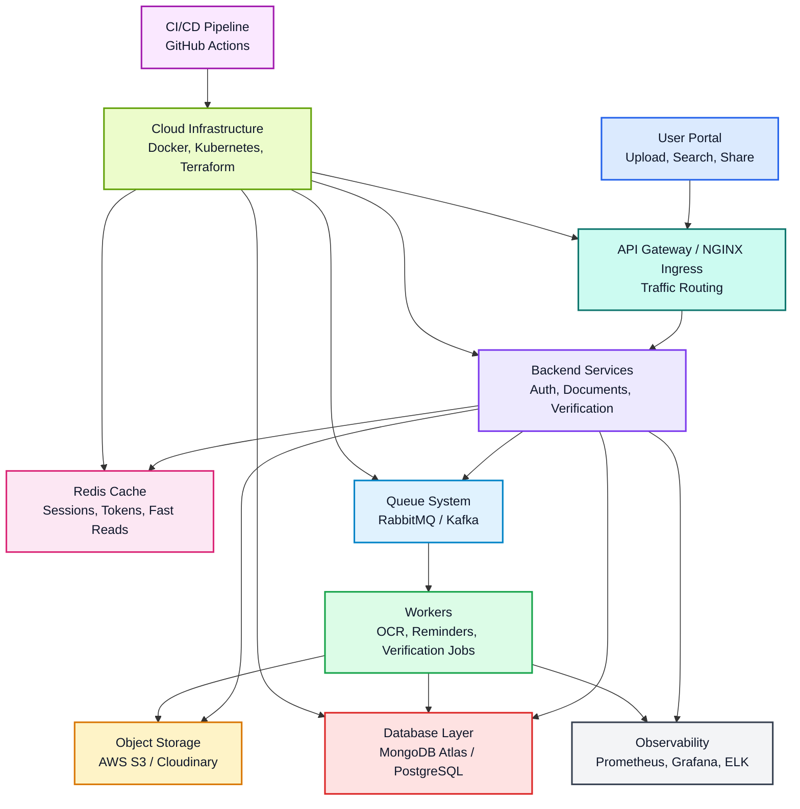
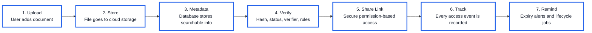
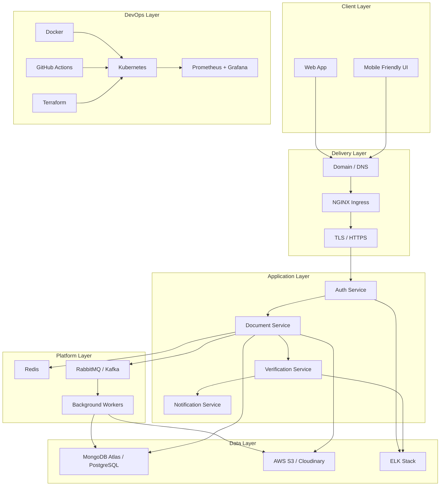
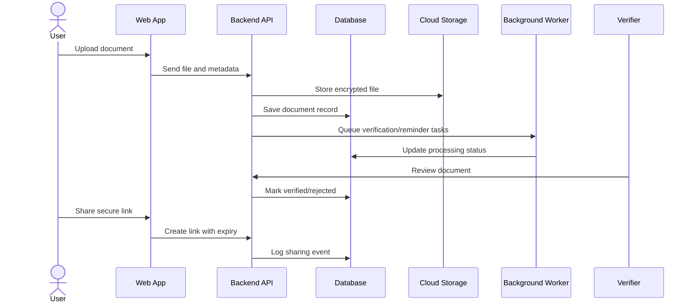

# Smart Document Management & Verification Platform

<p align="center">
  <b>A secure cloud-ready platform for uploading, storing, sharing, verifying, searching, and tracking important documents.</b>
</p>

<p align="center">
  
  
  
  
</p>

<p align="center">
  <a href="#project-vision">Vision</a> |
  <a href="#core-features">Features</a> |
  <a href="#3d-platform-flow">3D Flow</a> |
  <a href="#cloud-architecture">Architecture</a> |
  <a href="#development-phases">Phases</a> |
  <a href="#technology-stack">Tech Stack</a>
</p>

---

## Project Vision

The **Smart Document Management & Verification Platform** is designed as a modern digital document vault with verification intelligence.

Think of it as a powerful combination of:

| Inspiration | What This Platform Uses From It |
| --- | --- |
| Google Drive | Upload, organize, search, and share documents |
| DigiLocker | Secure identity-linked document storage |
| Verification System | Validate document authenticity and access history |

The goal is to help users and organizations manage documents with confidence: upload once, verify quickly, share safely, and track every access event.

---

## Core Features

| Feature | Description |
| --- | --- |
| Secure document upload | Upload PDFs, images, certificates, IDs, contracts, and other files |
| Smart document search | Search by title, owner, document type, tags, metadata, or verification status |
| Shareable secure links | Generate protected links with expiry, access limits, and permission controls |
| Document verification | Verify documents using metadata, hashes, approval workflow, or external APIs |
| Access history | Track who viewed, downloaded, shared, or verified a document |
| Expiry reminders | Notify users before documents expire |
| Role-based access | Separate user, verifier, admin, and organization-level permissions |
| Cloud storage | Store files in AWS S3, Cloudinary, Azure Blob, or similar object storage |
| Background jobs | Process verification, reminders, thumbnails, indexing, and email events |
| Monitoring | Observe system health with metrics, dashboards, and logs |

---

## 3D Platform Flow



### 3D Style Project Journey



---

## Cloud Architecture



---

## Technology Stack

| Technology | Use in Project |
| --- | --- |
| Docker | Containerize frontend, backend, database, workers, and supporting services |
| Kubernetes | Deploy and scale services in production |
| NGINX Ingress | Route external traffic to internal services |
| MongoDB Atlas / PostgreSQL | Main document, user, metadata, and audit database |
| Redis | Cache, session store, temporary tokens, and rate limiting |
| AWS S3 / Cloudinary | Secure document and image storage |
| RabbitMQ / Kafka | Background processing, reminders, verification jobs, indexing |
| GitHub Actions | Automated testing, building, and deployment |
| Prometheus | Metrics collection |
| Grafana | Monitoring dashboards |
| ELK Stack | Centralized logging and debugging |
| Terraform | Infrastructure as Code |
| AWS / Azure / GCP | Cloud hosting and deployment |

---

## Suggested Module Design

| Module | Responsibility |
| --- | --- |
| Authentication | Login, signup, JWT/session handling, password reset, role management |
| User Dashboard | Recent documents, verification status, reminders, quick actions |
| Document Manager | Upload, rename, tag, delete, preview, and organize documents |
| Sharing System | Generate links, set permissions, link expiry, revoke access |
| Verification Engine | Validate document hash, approval status, issuer details, external checks |
| Audit Trail | Track views, downloads, updates, shares, and verification attempts |
| Notification Service | Send expiry reminders, access alerts, verification updates |
| Admin Panel | Manage users, documents, reports, system settings, and suspicious activity |

---

## Development Phases

### Phase 1: Foundation

Build the core product skeleton.

| Goal | Deliverables |
| --- | --- |
| Project setup | Frontend, backend, environment config, folder structure |
| Authentication | Signup, login, logout, protected routes |
| Document upload | Basic upload flow and document listing |
| Database schema | Users, documents, metadata, access logs |
| Local development | Docker Compose for app, database, cache |

### Phase 2: Smart Document Management

Make the platform useful for real users.

| Goal | Deliverables |
| --- | --- |
| Search | Search by title, type, tags, owner, date, status |
| Document preview | PDF/image preview, metadata panel |
| Secure sharing | Link generation, expiry time, permission controls |
| Access history | View logs for document actions |
| Expiry reminders | Background job for upcoming expiry alerts |

### Phase 3: Verification & Automation

Add trust, workflow, and intelligence.

| Goal | Deliverables |
| --- | --- |
| Verification flow | Pending, verified, rejected, expired states |
| Hash validation | Detect changed or duplicate files |
| Verifier role | Special dashboard for document reviewers |
| Background jobs | Queue-based OCR, reminders, notifications |
| Audit reports | Exportable access and verification reports |

### Phase 4: Cloud, DevOps & Scale

Prepare the platform for production.

| Goal | Deliverables |
| --- | --- |
| Containerization | Docker images for frontend, backend, workers |
| Kubernetes | Deploy scalable app services |
| Ingress | NGINX routing with HTTPS |
| CI/CD | GitHub Actions pipeline |
| Monitoring | Prometheus metrics and Grafana dashboards |
| Logging | ELK Stack for centralized logs |
| Infrastructure | Terraform scripts for cloud resources |

---

## Example User Flow



---

## Security Goals

| Area | Planned Protection |
| --- | --- |
| Authentication | JWT/session security, password hashing, optional MFA |
| Authorization | Role-based and document-level permissions |
| File safety | File type validation, size limits, malware scanning option |
| Link sharing | Expiring links, tokenized access, revocation |
| Privacy | Encrypted storage and secure metadata handling |
| Auditing | Immutable-style access logs for sensitive document events |
| Rate limiting | Redis-backed API protection |

---

## Database Ideas

| Entity | Example Fields |
| --- | --- |
| User | id, name, email, passwordHash, role, createdAt |
| Document | id, ownerId, title, type, tags, fileUrl, hash, expiryDate, status |
| ShareLink | id, documentId, token, permission, expiresAt, maxViews, isRevoked |
| AccessLog | id, documentId, userId, action, ipAddress, userAgent, timestamp |
| Verification | id, documentId, verifierId, status, remarks, verifiedAt |
| Notification | id, userId, documentId, type, message, isRead, createdAt |

---

## Local Setup

> This repository currently contains the README and project blueprint. Add the application code as the project moves through the phases.

Suggested future commands:

```bash
# Clone the repository
git clone https://github.com/<your-username>/Smart-Document-Management-Verification-Platform.git

# Enter the project
cd Smart-Document-Management-Verification-Platform

# Start local services when Docker Compose is added
docker compose up --build
```

Suggested environment variables:

```env
APP_PORT=3000
API_PORT=5000
DATABASE_URL=
REDIS_URL=
S3_BUCKET_NAME=
S3_ACCESS_KEY=
S3_SECRET_KEY=
JWT_SECRET=
EMAIL_PROVIDER_API_KEY=
```

---

## API Blueprint

| Method | Endpoint | Purpose |
| --- | --- | --- |
| POST | `/api/auth/register` | Create user account |
| POST | `/api/auth/login` | Login user |
| POST | `/api/documents` | Upload document |
| GET | `/api/documents` | List and search documents |
| GET | `/api/documents/:id` | Get document details |
| POST | `/api/documents/:id/share` | Create secure share link |
| GET | `/api/share/:token` | Access shared document |
| POST | `/api/documents/:id/verify` | Verify or reject document |
| GET | `/api/documents/:id/history` | View access history |
| GET | `/api/notifications` | View reminders and alerts |

---

## Repository Roadmap

```text
Smart-Document-Management-Verification-Platform/
  frontend/              # Web application
  backend/               # API services
  workers/               # Background jobs
  infrastructure/        # Terraform and Kubernetes manifests
  monitoring/            # Prometheus, Grafana, logging config
  docs/                  # Architecture and API documentation
  docker-compose.yml     # Local development orchestration
  README.md              # Project overview
```

---

## Success Metrics

| Metric | Target |
| --- | --- |
| Upload reliability | Documents upload without data loss |
| Search speed | Fast metadata search for large document collections |
| Verification trust | Clear status and traceable reviewer history |
| Access transparency | Every sensitive action is logged |
| Cloud readiness | Deployable through containers and CI/CD |
| User experience | Simple upload, share, verify, and reminder workflows |

---

## Why This Project Stands Out

This platform is not only a file upload app. It is a complete document trust system:

- It stores documents securely.
- It makes documents easy to find.
- It verifies document authenticity.
- It tracks every important action.
- It reminds users before expiry.
- It is designed for cloud deployment from the beginning.

---

## Future Enhancements

| Enhancement | Value |
| --- | --- |
| OCR text extraction | Search inside scanned documents |
| AI document classification | Automatically detect document type |
| QR verification | Verify documents through QR codes |
| Blockchain hash registry | Tamper-resistant proof of authenticity |
| Organization workspace | Team-based document management |
| Digital signature support | Sign and validate important files |
| Mobile app | Upload and verify documents from phone |

---

## Contribution Guide

Contributions are welcome as the project grows.

Suggested workflow:

```bash
git checkout -b feature/your-feature-name
git add .
git commit -m "Add your feature"
git push origin feature/your-feature-name
```

Then open a pull request with:

- Clear feature description
- Screenshots or API examples if applicable
- Test notes
- Any environment changes

---

## License

Add your preferred license before public production use.

Common choices:

| License | Best For |
| --- | --- |
| MIT | Open and simple reuse |
| Apache 2.0 | Open source with patent protection |
| Private | Academic, internal, or startup prototype |

---

<p align="center">
  <b>Smart Document Management & Verification Platform</b><br>
  Secure documents. Verified trust. Cloud-ready scale.
</p>
