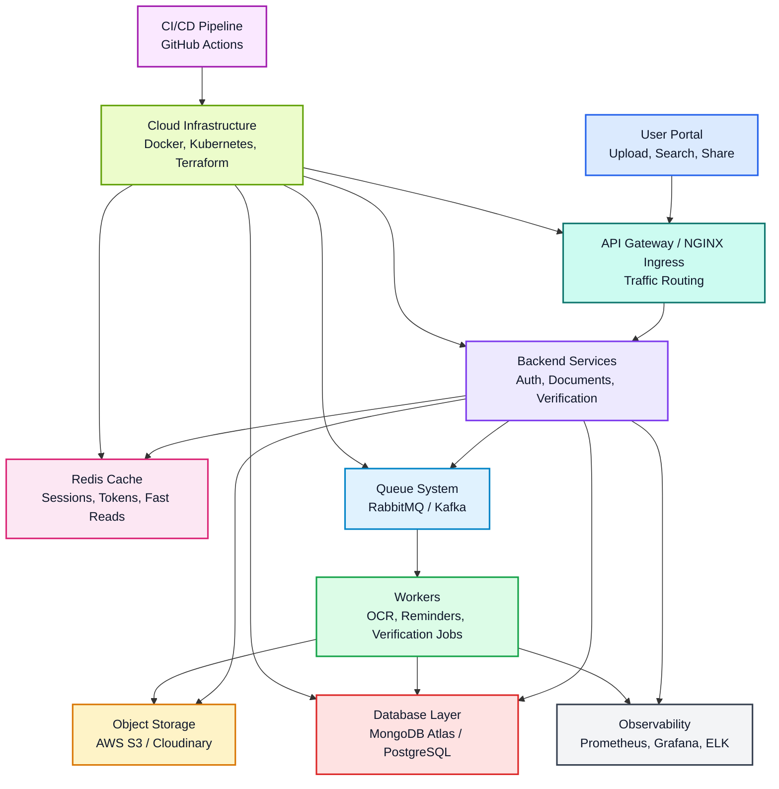
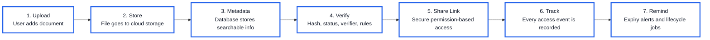
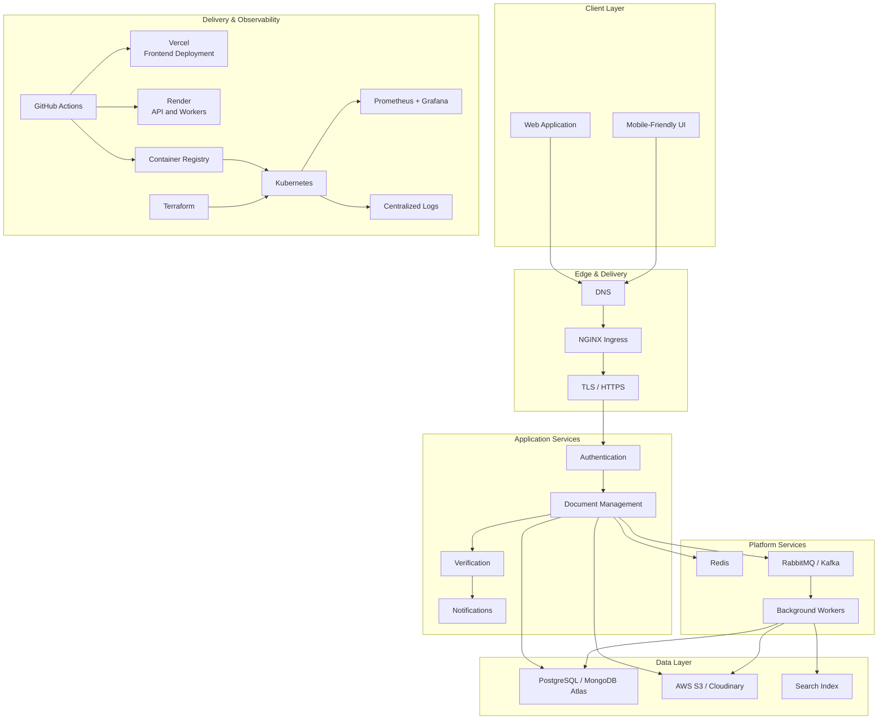
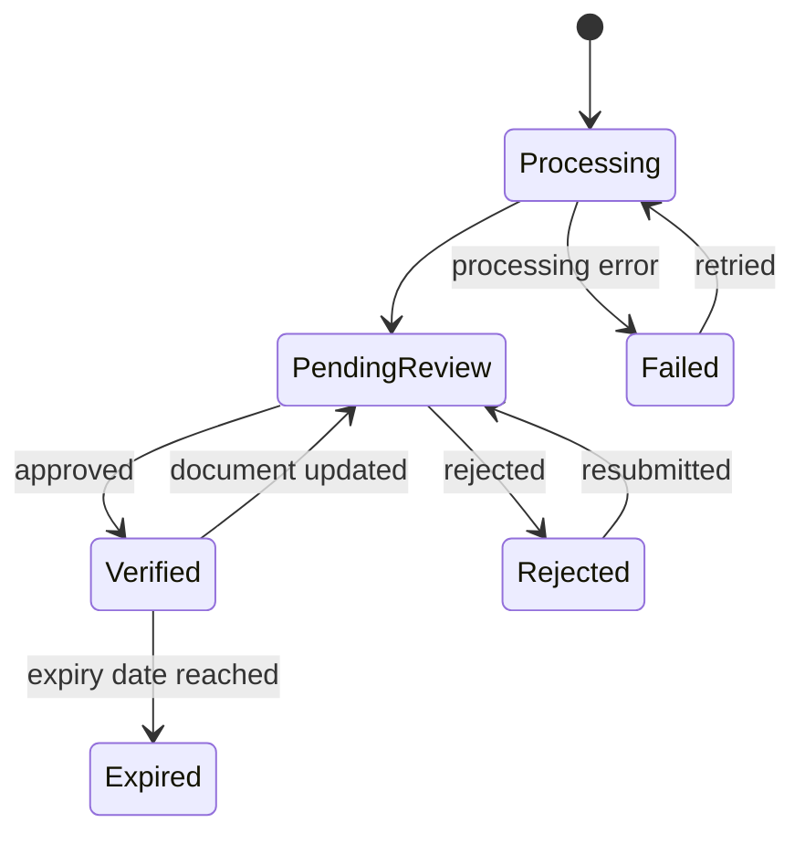

<div align="center">

# Smart Document Management & Verification Platform (CertiVault)

### A secure, cloud-native document vault built for trust, traceability, and effortless sharing.

Upload once. Find instantly. Verify confidently. Share safely. Track everything.

<br />

[](#project-status)
[](#security-by-design)
[](#cloud-architecture)
[](#contributing)
[](https://summerofcode.xyz)
[](LICENSE)

<br />

### Skills & Technologies


<br />

[Why it matters](#why-it-matters) |
[Features](#feature-map) |
[3D Platform Flow](#3d-platform-flow) |
[Architecture](#cloud-architecture) |
[Roadmap](#delivery-roadmap) |
[API](#api-blueprint) |
[Contributing](#contributing) |
[License](#license)

</div>

---

## The Big Idea

Important documents deserve more than a folder and a download button.

The **Smart Document Management & Verification Platform** is a blueprint for a modern document trust system: one place to securely store documents, verify their authenticity, control how they are shared, and preserve a complete history of every meaningful action.

It brings together the convenience of cloud storage, the confidence of identity-linked document systems, and the accountability of an auditable verification workflow.

```text
Traditional storage:  Upload -> Store -> Download

This platform:         Upload -> Protect -> Index -> Verify -> Share -> Audit -> Remind
```

> [!IMPORTANT]
> This repository currently documents the product vision, architecture, and delivery plan. Application code will be introduced incrementally through the roadmap below.

## Why It Matters

Document workflows often break down in the moments that matter most:

- A certificate is shared, but nobody can confirm whether it was modified.
- A contract expires, but the reminder arrives too late.
- A sensitive link stays active long after it should have been revoked.
- A reviewer approves a document, but the decision history is unclear.
- A team stores thousands of files, but cannot quickly find the right one.

This platform is designed to replace those gaps with **verifiable status, controlled access, searchable metadata, and a trustworthy audit trail**.

## Product Principles

| Principle | What it means in practice |
| --- | --- |
| **Trust is visible** | Every document has a clear verification state and traceable history. |
| **Access is intentional** | Sharing links expire, permissions are explicit, and access can be revoked. |
| **Security is foundational** | Encryption, authorization, validation, and auditing are part of the design. |
| **Search should feel instant** | Metadata, tags, ownership, status, and extracted text make documents discoverable. |
| **Operations should be observable** | Metrics, logs, alerts, and background-job health are first-class concerns. |
| **Infrastructure should be repeatable** | Containers, CI/CD, and Infrastructure as Code enable predictable deployment. |

---

## Feature Map

### Document Experience

| Capability | User value |
| --- | --- |
| Secure uploads | Store PDFs, images, IDs, certificates, contracts, and other important files. |
| Rich organization | Add titles, tags, types, expiry dates, owners, and custom metadata. |
| Smart search | Find documents by metadata, verification state, date, owner, or extracted text. |
| Document preview | Review files and important metadata without leaving the platform. |
| Expiry reminders | Receive alerts before time-sensitive documents expire. |

### Trust & Sharing

| Capability | User value |
| --- | --- |
| Verification workflows | Move documents through pending, verified, rejected, and expired states. |
| Integrity checks | Use cryptographic hashes to detect changed or duplicate files. |
| Protected share links | Set expiration, permissions, view limits, and revocation rules. |
| Role-based access | Separate permissions for users, verifiers, admins, and organizations. |
| Audit history | Track views, downloads, updates, shares, and verification decisions. |

### Platform Operations

| Capability | System value |
| --- | --- |
| Background processing | Run OCR, indexing, reminders, notifications, and verification jobs asynchronously. |
| Object storage | Keep files in durable cloud storage instead of the application database. |
| Caching and rate limits | Improve performance and protect sensitive endpoints with Redis. |
| Centralized observability | Monitor metrics, dashboards, logs, failures, and service health. |
| Automated delivery | Test, build, and deploy through a repeatable CI/CD pipeline. |

---

## Real-World Use Cases

| Use case | How the platform helps | Expected outcome |
| --- | --- | --- |
| Academic credentials | Institutions issue and verify certificates while graduates share protected links. | Faster checks with a traceable verification history. |
| Employee records | HR teams organize contracts, IDs, certifications, and renewal dates. | Fewer missed expirations and clearer access control. |
| Legal documents | Teams manage sensitive agreements with scoped sharing and audit logs. | Confidential collaboration with accountable access. |
| Vendor compliance | Organizations collect and review licenses, insurance, and compliance evidence. | Centralized status tracking and timely renewal reminders. |
| Personal document vault | Individuals securely store and share important identity and financial documents. | One searchable source of truth with controlled sharing. |

---

## 3D Platform Flow



### 3D Style Project Journey



---

## Cloud Architecture



### Architecture Notes

- **Files and metadata are separated:** large binary objects live in object storage; searchable records live in the database.
- **Slow work stays off the request path:** OCR, indexing, reminders, and notifications run through queued workers.
- **Services begin as logical boundaries:** they can ship as a modular monolith first and split only when scale demands it.
- **Every sensitive action emits an audit event:** document access and state changes remain traceable.
- **Cloud vendors remain replaceable:** the final provider choices should be recorded as Architecture Decision Records.

---

## Security By Design

Security is a system property, not a feature toggle.

| Control area | Planned protections |
| --- | --- |
| Identity | Strong password hashing, secure sessions or short-lived JWTs, optional MFA |
| Authorization | Role-based access plus document-level ownership and permission checks |
| Upload safety | Allowlisted file types, size limits, malware scanning, isolated processing |
| Data protection | TLS in transit, encryption at rest, secret management, least-privilege access |
| Share links | High-entropy tokens, expiration, view limits, revocation, scoped permissions |
| Integrity | Cryptographic hashing and duplicate/change detection |
| Abuse prevention | Redis-backed rate limiting, anomaly alerts, suspicious activity review |
| Auditing | Append-oriented records for access, sharing, updates, and verification decisions |
| Privacy | Data minimization, retention policies, secure deletion, metadata protection |

> [!CAUTION]
> The platform should not claim regulatory compliance until its implementation, operating controls, and deployment environment have been independently assessed.

### Verification State Model



---

## Suggested Technology Stack

The project intentionally leaves several implementation choices open while the architecture is being validated.

| Layer | Recommended options | Purpose |
| --- | --- | --- |
| Frontend | React / Next.js | Responsive dashboard, previews, and sharing experience |
| Backend | Node.js / JavaScript | APIs, authorization, workflows, and integrations |
| Application hosting | Vercel / Render | Deploy the frontend, API, and background workers |
| Database | PostgreSQL / MongoDB Atlas | Users, metadata, verification records, and audit events |
| Object storage | AWS S3 / Cloudinary / Azure Blob | Durable file storage |
| Cache | Redis | Sessions, tokens, rate limits, and hot reads |
| Queue | RabbitMQ / Kafka | Asynchronous processing and event delivery |
| Containers | Docker | Reproducible local and production environments |
| Orchestration | Kubernetes | Deployment, scaling, health checks, and resilience |
| Infrastructure | Terraform | Version-controlled cloud infrastructure |
| CI/CD | GitHub Actions | Automated testing, builds, scans, and deployments |
| Observability | Prometheus, Grafana, centralized logs | Metrics, dashboards, alerts, and debugging |

### Decision Strategy

Choose the smallest stack that safely supports the current phase:

1. Start with a modular application, one primary database, object storage, Redis, and a job queue.
2. Deploy the frontend on Vercel and the API or workers on Render for an accessible first production environment.
3. Add Kubernetes, advanced event streaming, and specialized search only when usage or operational needs justify them.
4. Record meaningful technology choices and tradeoffs in `docs/decisions/`.

---

## API Blueprint

The first API can stay compact and resource-oriented.

| Method | Endpoint | Purpose |
| --- | --- | --- |
| `POST` | `/api/auth/register` | Create an account |
| `POST` | `/api/auth/login` | Authenticate a user |
| `POST` | `/api/documents` | Upload a document and metadata |
| `GET` | `/api/documents` | Search and list accessible documents |
| `GET` | `/api/documents/:id` | View document details |
| `PATCH` | `/api/documents/:id` | Update document metadata |
| `POST` | `/api/documents/:id/share-links` | Create a protected share link |
| `DELETE` | `/api/documents/:id/share-links/:linkId` | Revoke a share link |
| `GET` | `/api/share/:token` | Access a shared document |
| `POST` | `/api/documents/:id/verifications` | Submit a verification decision |
| `GET` | `/api/documents/:id/history` | View the document audit history |
| `GET` | `/api/notifications` | View reminders and alerts |

<details>
<summary><strong>Example document response</strong></summary>

```json
{
  "id": "doc_01J...",
  "title": "Cloud Security Certificate",
  "type": "certificate",
  "status": "verified",
  "tags": ["cloud", "security"],
  "ownerId": "usr_01J...",
  "expiresAt": "2027-06-30T00:00:00Z",
  "verification": {
    "status": "verified",
    "reviewedAt": "2026-06-09T09:30:00Z"
  }
}
```

</details>

---

## Repository Blueprint

```text
.
|-- frontend/               # Web application
|-- backend/                # API and domain logic
|-- workers/                # Asynchronous jobs
|-- infrastructure/         # Terraform and Kubernetes manifests
|-- monitoring/             # Metrics, dashboards, alerts, and logging
|-- docs/
|   |-- architecture/       # Architecture documentation
|   `-- decisions/          # Architecture Decision Records
|-- tests/                  # Cross-service and end-to-end tests
|-- docker-compose.yml      # Local service orchestration
`-- README.md               # Project overview
```

---

## Delivery Roadmap

### Phase 1: Foundation

- [ ] Establish frontend, backend, and local development environments
- [ ] Implement registration, login, authorization, and protected routes
- [ ] Add secure document upload and basic document listing
- [ ] Define users, documents, metadata, and audit-event schemas
- [ ] Run application dependencies with Docker Compose

### Phase 2: Useful Document Management

- [ ] Add metadata search, tags, filters, and sorting
- [ ] Build PDF and image previews
- [ ] Add protected sharing with expiration and revocation
- [ ] Display document access history
- [ ] Schedule expiry reminders

### Phase 3: Verification & Automation

- [ ] Implement pending, verified, rejected, and expired states
- [ ] Add cryptographic integrity and duplicate detection
- [ ] Build a dedicated verifier workflow
- [ ] Process OCR, reminders, and notifications through workers
- [ ] Export audit and verification reports

### Phase 4: Production Readiness

- [ ] Automate tests, builds, security scans, and deployments
- [ ] Define infrastructure with Terraform
- [ ] Deploy services with Kubernetes and HTTPS ingress
- [ ] Add metrics, dashboards, alerts, and centralized logs
- [ ] Run backup, restore, load, and failure-recovery exercises

---

## Local Development

The executable application is not yet included. Once Phase 1 lands, the intended setup flow is:

```bash
git clone https://github.com/<your-username>/<repository-name>.git
cd <repository-name>
cp .env.example .env
docker compose up --build
```

Expected environment configuration:

```env
APP_PORT=3000
API_PORT=5000
DATABASE_URL=
REDIS_URL=
OBJECT_STORAGE_BUCKET=
OBJECT_STORAGE_REGION=
JWT_SECRET=
EMAIL_PROVIDER_API_KEY=
```

Never commit real credentials. Use a managed secret store in deployed environments.

---

## Deployment Plan

| Component | Initial platform | Scale-up path |
| --- | --- | --- |
| Next.js frontend | Vercel | Vercel or containerized deployment |
| Node.js API | Render Web Service | Kubernetes deployment |
| Background workers | Render Background Workers | Kubernetes worker deployments |
| Database | Managed PostgreSQL / MongoDB Atlas | Multi-zone managed database |
| Files | AWS S3 / compatible object storage | Replicated object storage with lifecycle policies |
| Cache and jobs | Managed Redis / queue service | Highly available platform services |

Vercel and Render provide a straightforward first deployment path. Kubernetes and Terraform remain the production scale-up strategy when traffic, resilience, or operational requirements justify the added complexity.

---

## Quality Bar

The platform is ready for production only when it can demonstrate:

| Area | Definition of success |
| --- | --- |
| Reliability | Uploads are durable, retryable, and protected against partial failure. |
| Performance | Common searches and document views stay responsive under expected load. |
| Trust | Every verification decision is attributable and every integrity check is reproducible. |
| Security | Sensitive operations are authorized, rate-limited, logged, and tested. |
| Recoverability | Backups are automated and restores are routinely verified. |
| Accessibility | Core workflows are keyboard-friendly and meet applicable WCAG guidance. |
| Operability | Failures are visible through actionable logs, metrics, dashboards, and alerts. |

---

## Future Possibilities

- OCR-powered full-text search for scanned documents
- Automatic document classification and metadata suggestions
- QR-based public verification pages
- Digital signatures and issuer integrations
- Organization workspaces and delegated administration
- Configurable retention and legal-hold policies
- Native mobile capture and verification
- Tamper-evident external hash registry

---

## Contributing

Contributions are welcome as the platform moves from blueprint to implementation.

CertiVault is participating in **Elite Coders Summer of Code (ECSoC) 2026**, with
[Krishna Kumar](https://github.com/Krishnx21) serving as the **Project Admin**.
ECSoC contributors and first-time open-source contributors are warmly encouraged
to explore the roadmap, discuss an issue, and submit focused pull requests.

Read [CONTRIBUTING.md](CONTRIBUTING.md) before opening a pull request. By participating, you agree to follow the [Code of Conduct](CODE_OF_CONDUCT.md).

Security issues must be reported privately according to [SECURITY.md](SECURITY.md), not through public issues.

If this project is useful to you, please **[star CertiVault](https://github.com/Krishnx21/CertiVault)**
and **[follow the Project Admin](https://github.com/Krishnx21)** for updates.

---

## Project Status

**Current stage:** Architecture blueprint and implementation planning.

| Artifact | Status |
| --- | --- |
| Product vision | Defined |
| Feature map | Defined |
| Cloud architecture | Proposed |
| Security model | Proposed |
| Domain model | Proposed |
| API surface | Proposed |
| Application implementation | Not started |
| Production deployment | Not started |

---

## License

<p align="center">
  <a href="LICENSE"></a>
</p>

This project is proudly released under the **MIT License**.

You may use, modify, distribute, and build upon the project while preserving
the copyright and license notice. See the [LICENSE](LICENSE) file for the full
terms.

| Permission | Included |
| --- | --- |
| Commercial use | Yes |
| Modification | Yes |
| Distribution | Yes |
| Private use | Yes |

---

<div align="center">

### Build more than document storage. Build document trust.

**Secure documents | Verifiable history | Controlled sharing | Cloud-ready architecture**

</div>
